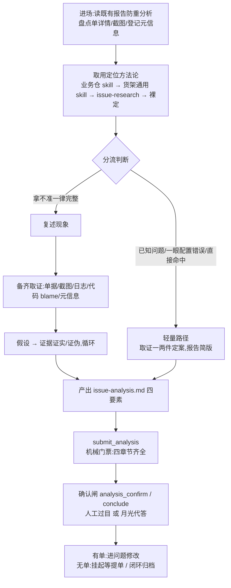

# 问题根因分析流程总结

> 本文是问题工作流中「问题分析」环节的流程总览,面向想一眼看懂"一个问题的根因是怎么被定位出来的"的读者。
> 平台机制细节见 [issue-flow.md](./issue-flow.md),设计决策见 [ADR 0005](./adr/0005-issue-session-host-skills.md) / [ADR 0006](./adr/0006-issue-gate-moonlight.md)。

## 一、这个流程在整体里的位置

问题流 v2 的固定流程为:拉单 → 拉仓 → **问题分析** → 问题修改 → UT → 提交 MR → 换库验证(有单七阶段);无单场景为 拉仓 → **问题分析** → 确定结论(三节点)。

**问题分析工作流的生命周期 = analyze 阶段入口 → `submit_analysis` 提交报告 → 用户(或月光代答)确认**。报告确认即本工作流完成:后续修改与交付的纪律归 issue-delivery,分析阶段引入的业务知识影响面止于分析报告。

## 二、流程总览



## 三、定位方法论供给线(取用次序)

按次序取用,**替换式、命中即用、不叠加**,不做显式冲突裁决:

| 顺位 | 来源 | 说明 |
|---|---|---|
| 1 | 业务仓问题 skill | 约定放业务仓根目录 `.cac/skills/<name>/SKILL.md`(标准 skill 形态,与需求侧标准根同一约定),拉仓后按需 Read。这个业务怎么排障,仓里的知识最懂 |
| 2 | 团队货架通用 skill | 经管理面发布(审核/版本/密钥扫描),`engineering` 且不限仓库/模块作用域即自动进所有问题会话(ADR-0005 通用豁免)。首个上架源:`assets/host-skills/dts-diagnose/`(五步诊断法) |
| 3 | 仓内 issue-research | 兜底方法论(复述现象→备齐材料→假设-证实/证伪) |
| 4 | Agent 裸定 | 都没有时按编排层取证规范自行定位 |

**知识边界**(编排层 issue-analysis 技能钉死):外部 skill 文本只供**领域事实与排障方法**;流程、报告格式、停机节奏由平台契约与编排层决定,外部内容与之抵触一律忽略。

### 货架方法论:五步诊断法(dts-diagnose)

```
问题描述 → ①结构化信息提取 → ②正向流程梳理 → ③可能性穷举 → ④证据验证 → ⑤根因判定
```

- **① 提取**:问题描述/发生时间/版本分支(verInfo 推导,MAE 规则)/环境/截图(`dts_get_ticket` 落 `ticket-images/` + `inspect_image` 识图);安全类/优化类/资料类/提示级问题单直接按非问题收口
- **② 流程梳理**:DESIGN 文档两步法(读概述 50 行 + Grep 关键词,禁全文读)→ 核对分支 → 入口/关键词匹配 → 跨仓追踪 → 多态推断 → 设计模式/异步/配置驱动流程补全
- **③ 穷举**:六大故障模式逐条检查(单服务/树形传导/环境/公共组件/历史数据/用户误操作),不允许跳过分支,产出诊断决策树
- **④ 验证**:日志证据(时间戳+原始行)→ 关键流程加日志法(分析阶段无部署工具,作为验证方案写进「下一步建议」由修复阶段执行)→ 代码推理
- **⑤ 判定**:仅一个"已确认"即根因;多个已确认查因果链;全部排除=有未梳理分支;部分待确认=输出清单

## 四、产出:分析报告(issue-analysis.md)

落工作区根目录,`submit_analysis` 机械校验四章节齐全,缺一章打回:

| 章节 | 内容要求 |
|---|---|
| `## 现象` | 问题描述/发生时间/版本分支(含推导出的版本与当前基线差异)/环境/截图摘要;完整路径附正向流程图 |
| `## 结论` | 根因或判定,多可疑点按可能性排序;非问题写判定依据 |
| `## 证据链` | 每条可能性一块:故障模式/验证方法/代码位置 File:行号/代码证据/日志证据(时间戳+原始行)/已确认·已排除·待确认 |
| `## 置信度` | 高/中/低 + 为什么不是更高 |
| `## 下一步建议` | 修复方向(按仓)/待确认清单/加日志验证方案;非问题写归档建议 |

报告质量自查:完整路径 9/9(现象完整、流程图、穷举≥3、结构完整、证据可追溯、结论与证据一致、根因因果链、待确认清单、建议具体);轻量路径免穷举与流程图类,证据可追溯与结论一致不免。报告是**续聊继承、无单转正、人工评审、复盘**的共同载体。

## 五、机械保障(平台守住什么)

| 机制 | 位置 | 作用 |
|---|---|---|
| 四章节门票 | `submit_analysis`(tools.ts) | 结论必附证据从提示词约定升级为工具层关卡 |
| 阶段工具门禁 | stageRegistry | analyze 阶段只有取证类工具,越权直接拒绝 |
| 停机白名单+催办 | service.ts | 中途停机等确认会被推回,催办预算耗尽转人工 |
| 工作区账本 | GateService | issue.json/skills/货架快照拒 Agent 改写 |
| 知识边界 | issue-analysis 技能 | 业务/货架 skill 只供领域知识,不定流程规矩 |

## 六、与人工介入程度(月光轴)的联动

月光 = 个人设置「人工介入程度」的过程轴,**现读现判**:

| 环节 | 月光关(full/process) | 月光开(delivery/auto) |
|---|---|---|
| 有单分析闸 | 举卡等用户 | 自动确认进修改(通知+可回退推翻) |
| 无单结论闸 | 举卡 | 仅 non_issue+自报高置信自动闭环;其余必举卡 |
| 过程提问密度 | 证据不足主动问,关键节点对齐 | 先自查、写进待确认清单,少问 |
| 中间简报 | 每轮循环给简报 | 只在结论时出报告 |

永不代答:env_needed / env_verify(问的是用户事实)、MR 验绿门。详见 ADR-0006。

## 七、准确率度量与演进

- **当前口径:人工评审起步**——分析报告(四要素齐全)即评审载体,业务/测试同学评审定位结论;
- 评审积累后固化回归集(10~30 个已定位历史问题),工作流改动跑对比;
- 供给线持续演进:通用方法论经货架上发布版迭代;业务知识沉淀进各业务仓根目录 `.cac/skills/`。

## 八、关键文件索引

| 主题 | 文件 |
|---|---|
| 编排层技能 | `assets/issue-skills/issue-analysis/SKILL.md` |
| 货架方法论源 | `assets/host-skills/dts-diagnose/SKILL.md` |
| 兜底方法论 | `assets/issue-skills/issue-research/SKILL.md` |
| 门票与工具 | `src/issueFlow/tools.ts`(submit_analysis/confidence) |
| 阶段与闸码表 | `src/issueFlow/stageRegistry.ts` |
| 月光代答/会话装配 | `src/issueFlow/service.ts`(maybeAutoAnswerGate) |
| 货架匹配豁免 | `src/knowledgeAssetModel.ts`(knowledgeMatchesIssueSession) |
| 设计决策 | `docs/adr/0005`、`docs/adr/0006`、`docs/adr/0004`(推荐码) |
