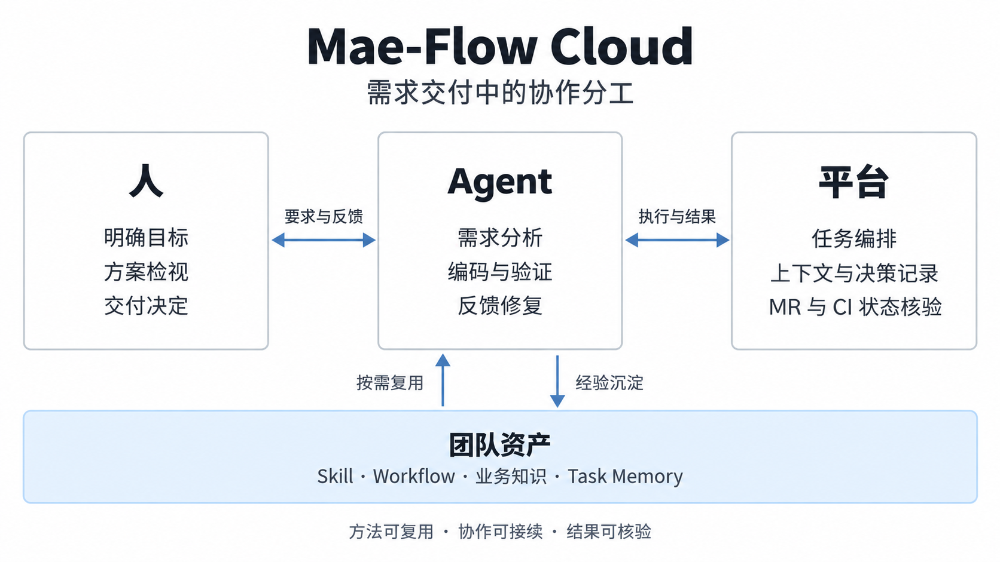

# 从个人提效到组织提效：我们为什么做 Mae-Flow Cloud

Mae-Flow Cloud 的初衷，是**从个人提效走向组织提效，构建团队自己的 AI 工程能力**。

一个人熟悉 AI 工具以后，可以更快地写代码、查问题、补测试。但当我们把视角放到整个团队，问题就变了：这些能力能不能被其他人用起来？一个人探索出来的方法，能不能帮助下一项任务？几个人各自用 AI 做得很快，最后能不能更顺畅地交付同一个需求？

个人提效已经让我们看到很多可能性。我们想继续往前做，让 AI 的使用经验逐渐成为团队可以共享、积累和改进的工作能力。

因此，这套平台既要让 AI 能执行具体任务，也要处理任务之间、人与人之间的衔接。需求怎么理解，工作怎么分，意见怎么传，结果怎么验证，经验怎么留下，这些都进入了我们的建设范围。

*协作总览：人明确目标并作出交付决定，Agent 推进执行，平台管理任务与结果，团队资产供后续工作复用。*

## 个人用得好，怎样让团队也用得好

一个 AI 超级个体往往承担了很多看不见的工作。他知道如何组织上下文，什么时候拆分任务，怎样调整 Prompt，拿到结果后又该如何验证。工具能做出好结果，其中也有这个人的判断和经验。

推广到团队时，如果每个人都得重新摸索一遍，能力就很难积累。换一个人接手，或者换一个业务模块，又可能回到起点。

我们希望平台能承接其中可以复用的部分。**工程方法可以沉淀为 Skill，通过 Workflow 组织和复用**；业务知识由模块 Owner 持续维护，任务上下文在协作与交接中保留，交付反馈进入原任务的修复与验证闭环。这样，一个人的经验才有机会被更多人用上。

比如，一位开发者摸索出一套适合某类服务的单元测试方法，可以把它沉淀为 Skill，说明适用场景和使用条件。其他成员处理类似需求时，就能直接使用，并根据实践继续完善。业务模块的接口约定、设计经验和排障方法，也可以这样积累下来。

我们希望通过平台，**让 AI 超级个体的经验逐步成为团队的公共能力**。新成员开展任务时，有现成的 Skill、Workflow 和业务知识可用；多人协作时，共享需求、设计和决策上下文；任务完成后，有价值的经验继续沉淀，供后续需求使用。组织提效要体现在这些具体变化上，让更多人能够利用团队已有的积累完成工作。

## 从编码提速到端到端交付

如果只看一次模型调用，好的结果可能是一段正确代码。如果看一个需求，事情就复杂得多：需求是否理解准确，相关模块是否协调好，测试有没有覆盖真正关心的行为，检视意见有没有处理，代码最后是否进入了可用的版本。

**我们围绕需求交付的全生命周期构建系统**。编码提速能缩短其中一段，但如果团队仍然耗费大量时间在沟通、等待和返工上，个人省下的时间就很难转化为组织的交付效率。

这要求系统持续跟进需求的实际交付情况：方案中的关键问题是否明确，模块之间的接口契约是否一致，端到端业务场景是否得到验证。Agent 完成一轮执行、文档产出或模块开发，都只是阶段性进展；尚未解决的问题和验证缺口，需要继续跟进，并纳入最终的交付判断。

同样，需求也不适合被想象成开工时就能描述完整的东西。人经常是看过方案才发现遗漏，看过实现才知道原先的说法有歧义。我们希望系统能够承接这种逐步明确的过程。用户可以改主意，设计可以修订，任务安排可以调整，之前做过的工作则尽量接着用。

Mae-Flow Cloud 因而选择从需求交付切入组织级 AI 工程能力建设。我们关心任务在几轮讨论、几次修改和几个人的协作之后，能否继续保有清楚的目标和上下文。这些衔接如果仍然完全靠个人记住和转述，团队规模一大，局部节省的时间就可能消耗在交接里。

落到使用上，需求可以在工作台里完成澄清和设计，按模块分配给不同任务 Owner，由 Agent 编码、验证，再接到代码平台的 MR 和 CI 流水线。有了可定位的失败或新的检视意见，系统会把反馈交回处理过程，修复后继续验证。我们把提交以后的这一段也做进去，就是希望任务能跟着实际结果继续走，少靠人来回转述和催促。

> **实战截图｜从流水线反馈到修复验证**
>
> 待补入同一任务的流水线失败、Agent 修复记录和后续验证结果。尽量保留对应版本与时间，展示一次具体反馈如何完成处理。

<!-- 图片到位后，将上面的编辑提示替换为截图和基于实际记录的简短图注。不要把旧版本通过当作当前版本通过。 -->

## 人的注意力应该花在哪里

衡量 AI 自动化的价值，需要看它是否减少了重复劳动，让人的精力更多地投入关键判断。单纯减少人工操作次数，还不足以说明效率得到了提升。

让人确认一次重要的业务取舍，可能很有价值。让人第三次确认已经确认过的内容，通常只是在消耗耐心。两者在界面上可能都是一个按钮，在实际工作里的意义却完全不同。

人的注意力有限。系统如果不断用低价值的问题打断人，真正重要的决定到来时，人也容易习惯性地点过去。确认次数多，并不自然意味着控制得更好。

因此，我们希望日常的查资料、执行、验证和反馈处理能尽量连续进行。需要人参与时，应**提供完整的决策背景，说明当前分歧、判断依据和可能影响**。

这也是为什么我们把方案检视和 Code Review 放在同一个任务工作台。它的意义在于减少理解成本：现在讨论的是哪一版，为什么要改，改完影响谁，已有证据是什么。人看得明白，才能把精力用在判断上。

工作台支持直接在设计和代码上提意见，查看 Agent 的处理回执，再由当前任务责任人逐条决定如何处置。执行中也可以补充要求、暂停或接管，之后交还继续。这些能力让人可以根据任务进展随时介入，补充需求、纠正偏差或调整方向，相关决定也能及时进入 Agent 的后续执行。

> **实战截图｜一条检视意见如何进入执行**
>
> 待补入一条真实意见及其 Agent 回执，最好能同时看到对应的文档或代码修改。若有 Owner 的处置记录，一并展示。

<!-- 图注只描述画面可证实的进展；收到意见、完成修改、人工确认分别表述。 -->

还有一点是，**人的决定必须有后续效力**。用户说过的话不能只停留在聊天记录里。我们遇到过 AI 已经表示理解，文档、测试和实现却继续沿用旧要求的情况。对使用者来说，这会迅速破坏信任：既然说了也不算数，就只能一直盯着。

**只有人的要求和决定能落实到后续执行中，才能减少持续跟进与反复纠正的负担**。这个问题不解决，所谓自动化只能靠人工监工维持。

## 我们愿意把多大的判断空间交给 AI

这是绕不开的问题。

让 Agent 独立推进任务，需要赋予它选择执行方法、应对需求变化和处理反馈的自主权。同时，也需要明确目标、约束和验收依据，及时发现理解偏差、范围偏离或遗漏的工作。

我们的做法也经历过摇摆。早期加了很多约束，希望把常见错误提前挡住：要求特定材料、检查文档形式、核对回执、限制预计修改范围。每一条都能解释为什么需要，但放在一起，Agent 有时会花很多精力满足这些条件，实际工作却没有向前多少。

后来我们逐渐接受了一件事：有些判断必须交给 AI 去做，再通过结果和检视来发现问题。把它们拆成更多规则，并不一定判断得更准。

比如，分析时列出的文件路径不可能永远完整。实现中发现需要调整一处公共代码，要看的是影响是否合理，不能仅凭它没出现在原清单里就停下来。又比如，文档章节齐全很容易检查，但业务含义有没有说对，需要读内容。

现在我们更倾向于**用 Prompt 和 Skill 表达工作方法，用检视讨论具体质量，由平台核验操作权限、人工决策和实际执行结果**。权限、用户的实际回答、取消和接管、远端推送、流水线结果，都有可以追查的依据；方案好不好、测试是否充分，则需要结合任务理解。

这条边界还会调整。我们也没有把“尽量自主”理解为所有工作都用同样的介入程度。人工介入的程度应根据任务的复杂度、不确定性和影响范围来确定。需求明确、影响可控的修改可以交给 Agent 自主推进；涉及未知业务或跨模块设计时，则需要更多需求澄清和方案检视。

我们想逐步建立的，是一种能放手、也能介入的合作关系。放手之后任务应该持续推进；发现偏差时，人能看懂、改得动，并且不必把之前的工作全部推倒。平台应将 AI 超级个体的实践经验沉淀为可复用的 Skill、Workflow 和业务知识，帮助不同经验水平的成员开展任务，减少对个人指导的依赖。

建设共同的工程方法，也要控制流程成本。我们删掉了一些重复确认和形式检查，把工作方法更多交给 Prompt、Skill 和检视来约束，平台保留权限、人工决定和真实交付结果的核验。取舍很直接：流程要带来实际的质量收益；收益不足，就应该简化。同时，失败和验证缺口仍然如实保留，供责任人判断。

## 以全局设计支撑多 Agent 协作

把一个需求分给多个 Agent，看上去很适合并行。实际做下来，会更关心大家是不是在做同一件事。

如果各模块对接口语义、数据结构和异常处理缺少一致约定，即使各自完成开发并通过测试，集成时仍可能出现兼容性问题。前期并行开发节省的时间，也可能被后续联调和返工抵消。

因此，我们**把整体设计放在模块分工之前**。需要先说清用户场景、职责和关键约定，再让各模块细化自己的实现。团队需要有一份可以共同讨论和持续修订的理解。

系统用 **整体设计文档** 承载这份设计，提供 4+1 架构视图、版本管理和方案检视入口。确认分工后，子任务通过 Spec 定义行为与验收条件，通过模块 Story 细化设计，并引用全局接口契约。多仓需求和单仓大需求都可以按模块组织；执行依赖由平台管理，责任人也可以查看影响后调整尚未开工任务的等待关系。这样，全局设计与模块实现能够对齐，任务编排也保留调整空间。

> **实战截图｜一个需求的模块分工**
>
> 待补入同一需求的整体架构与任务分工，突出模块职责、Owner 和依赖关系。画面较多时只选两张，配一句说明这个需求为何需要这样拆分。

<!-- 优先与交付反馈截图使用同一需求，串成一个实战案例。截图标题与架构内容须可对照，避免只截任务数量。 -->

我们也更倾向于按能够说明业务行为的模块拆任务。每个模块应围绕明确的业务能力完成实现与验证，由任务 Owner 对照验收条件确认交付结果。按接口、逻辑、测试等技术步骤拆分，容易分散验收责任，出现各项工作均已完成、业务行为却缺少完整验证的情况。

这让我们越来越重视责任的连续性。工作可以交给 AI，质量判断和交付取舍仍然要有人负责。检视意见谁来处置，哪些缺口可以接受，跨模块变化由谁协调，需要明确。否则自动化越多，出了问题以后越难说清当时为什么会这样做。

软件开发原有的设计、评审和分工，并没有因为 AI 能写代码就失去意义。这些工程实践也需要适应 Agent 参与后的协作方式。文档和沟通形式可以简化，但需求目标、模块职责、接口契约和验收条件必须明确，作为团队与 Agent 协同执行的共同依据。

## 将实践经验沉淀为团队资产

一项任务做完以后，如果下一项任务还要从同一个坑里爬一遍，系统的收益就停留在了当次执行。从个人提效走向组织提效，我们很看重这一点：**一个人付出的探索成本，能否让后来的人少走一些弯路**。

我们通过知识资产和 **Task Memory** 沉淀研发过程中的设计决策、接口约定、排障经验，以及已验证或放弃的方案，供后续任务检索和复用。

这些内容需要保留来源、适用范围和版本信息，并根据当前任务按需提供。复用时既要判断相关性，也要核对时效性，避免将过时经验或特定任务中的临时约定直接用于新的需求。

知识资产由团队和业务模块的维护者管理，经过整理与发布，形成可复用的工程方法和业务知识。任务中有价值的内容可以提取为候选，纳入后续维护。Task Memory 则根据当前任务召回相关历史经验，Agent 可以进一步检索原文，了解当时的背景和处理依据。两者共同支持团队知识在日常研发中的持续积累与应用。

> **实战截图｜团队资产在任务中的使用**
>
> 待补入一项 Skill 或业务知识的内容，以及任务中的引用或读取记录。若有后续执行结果，可以补充说明；只有读取记录时，就只说明该资产被使用过。

<!-- 优先展示可读的知识条目与使用场景，避免用资产总数或“已召回”直接证明提效。 -->

我们因此区分团队维护的知识、仓库中的约定和任务产生的经验。它们的来源和适用范围不同。AI 自己总结的一条经验，不能因为写进了记忆，就变成团队必须遵守的规则；一个项目的限制，也不应该被无条件带到另一个项目。

这里还有一个容易忽略的问题：经验应该能被修正。新任务遇到的条件变了，旧做法可能不再合适。系统需要保留来由，让人和 AI 能判断这条经验为什么成立、现在还是否成立。

我们希望将依赖个人积累的隐性经验，逐步转化为团队可检索、可复用的知识资产。评价这项能力，需要看相关知识能否在任务需要时被准确召回，是否帮助 Agent 作出合理判断，以及是否减少了重复分析和返工。这些效果需要通过实际任务持续验证。

## 信任是从不顺利的时候建立的

系统顺着预期路径完成一次任务，比较容易让人觉得“可以用了”。但决定人敢不敢长期交给它工作的，往往是出问题之后的表现。

中途重启，能不能继续；用户改口，会不会丢；外部已经合入，平台能不能认出来；报错信息不足，AI 会不会乱猜；一项动作不知道有没有成功，恢复时会不会重复执行。

这些问题不像新功能那么容易展示，却会直接影响人愿意放手到什么程度。如果每次离开一会儿都担心任务停了、跑偏了，或者回来以后还要重新交代，系统就仍然需要一个人一直照看。

我们花了很多时间处理**会话持久化与恢复、反馈闭环，以及远端 Git、MR 和流水线状态核验**，以保障任务执行的连续性与可追溯性。任务具备执行条件时应持续推进，遇到阻塞时应明确原因和所需支持；已确认的决定应在恢复与重试后保持有效，异常处理也应有完整记录可供核查。

与此同时，也要承认能力的边界。没有可靠证据，就不能假装知道；尚未落盘的上下文，无法靠恢复机制补回来。坦诚暴露这些边界，会给后续判断留下空间。

任务是否完成，要看代码是否合入、当前版本是否通过验证、检视意见是否处理，以及是否还有遗留风险。平台应把这些结果展示清楚，供任务 Owner 确认。

## 最后还是要回到一项项需求

Mae-Flow Cloud 已将需求澄清、方案设计、模块开发、检视和验证接入同一交付过程。

这些能力现在都有了具体形态，但系统有没有价值，还要看人用它完成一项工作时的感受和结果。

我们更希望看到，使用它以后，人少做了多少重复交代和机械协调，关键决定是否更容易作出，一个需求是否更顺畅地到达可交付状态。**还要看返工、等待和交付后的问题，不能只看编码阶段有多快**。

从团队层面看，我们关注新成员能否借助已有 Skill 和 Workflow 独立开展任务，任务交接是否保留完整上下文，积累的经验是否被后续需求复用，以及更多成员能否自主使用 AI 完成交付。

我们会通过实际需求的交付周期、协作成本和质量表现，持续检验平台的效果，并据此调整工作方式。

Mae-Flow Cloud 要建设的，是团队能够持续使用和完善的 AI 工程能力：Agent 承担执行，人在关键环节明确目标、作出取舍并验收结果，实践中的有效方法则沉淀为 Skill、Workflow 和知识资产。

**从个人提效到组织提效，关键在于让个人经验成为团队可复用的能力**。我们希望每次需求交付都能为后续工作积累经验，让更多成员借助团队已有的方法和知识完成交付。这也是平台长期建设的价值所在。
