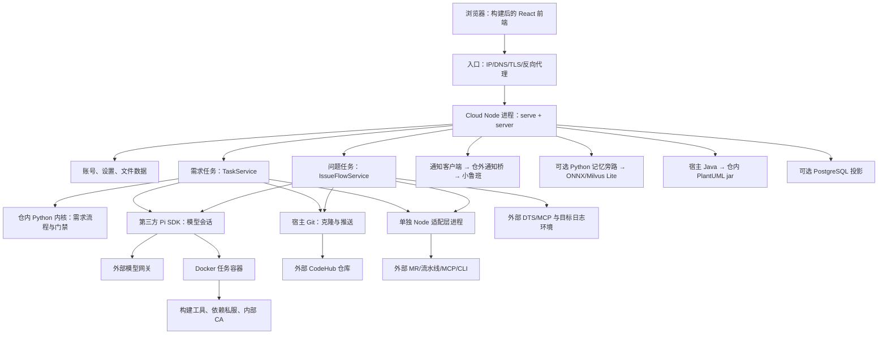

# 系统组件承载与重建边界审计

初始审计基线：`0f848b845712597b7abf055c4536cf5695321d85`（2026-09-07）；完成前补核远端 `777f103` 的增量，包括问题工作台、人工接管及多仓规则注入。本报告核对 Git 跟踪文件、启动装配、运行时调用及持久化路径；不是对已释放服务器的运行检查。旧服务器实际镜像、配置值、人工补丁、网关可达性及外部服务存活状态无法由本仓证明。

**结论：业务程序主体已在仓内，但本仓还不是能一键重建原服务的完整部署交付件。** 缺口主要是生产配置与接入脚本、第三方运行环境、实际平台知识资产，以及运行数据。不能把“实现代码在仓里”“文档里提到了”“二进制在仓里”“新机启动即启用”混为一谈。

## 1. 实际运行链路

- **不是每个页面一个服务。** 工作台、团队任务、知识管理、账号管理由同一个 Cloud HTTP 服务承载；正式前端由它读取 `web/dist` 提供，没有生产 Vite 进程。依据：[启动与 HTTP 装配](../src/serve.ts)、[服务器路由](../src/server.ts)。
- **不是每个 Agent 一个独立服务器。** 主 Agent、子 Agent、开发助手、预热和 Build-Fix 的调度/会话实现都在 Cloud；Pi SDK 进程内装配，模型推理由外部网关提供；任务 Bash 执行进入 Docker。依据：[会话驱动](../src/sessionDriver.ts)、[容器运行时](../src/containerRuntime.ts)。
- **需求与问题是两条业务流程。** 需求使用 Python 内核；问题使用 `src/issueFlow/stageRegistry.ts` 的固定阶段与 `issue.json`，不能用“恢复内核”代替恢复问题链路。两者共享账号、模型、隔离和交付接入，但各有状态与材料。
- **最新问题流增量也在仓内。** 多仓规则注入由 `src/issueFlow/repoContextFiles.ts` 从已克隆业务仓收集 AGENTS/CLAUDE 文件，再交给 `sessionDriver.ts`；仓库原文仍来自业务仓。人工接管实现位于 `issueFlow/service.ts`，标记写入 `issue.json`、人工记录写入 `events.jsonl`，没有新增独立服务；旧数据丢失也会丢失这些记录。
- 原部署脚本包记录了生产与测试各三项 systemd 服务：Cloud、adapter、通知桥。生产端口为 8787/8790/8791，测试为 8788/8792/8793。**这些只是留存文档中的旧值，不能证明旧服务器释放前仍使用它们，更不能直接当作新机参数。**

## 2. 逐组件归属、缺件和影响

“仓内”在本表中严格指 Git 已跟踪，不包括本机 `node_modules`、`.pilot`、`.local` 或未提交文件。

| 环节 / 组件 | 本仓实际承载 | 仓外还需要什么 | 只拉本仓后的结果 / 验收点 |
| --- | --- | --- | --- |
| 正式前端 | `web/src/`、Vite 配置、前端包清单与锁文件 | 对应平台 Node/npm、依赖包源 | 必须重新构建 `web/dist`；没有 dist 会回退简易页面，能打开网页不等于正式工作台恢复 |
| Cloud API 与业务宿主 | `src/serve.ts`、`server.ts`、`taskService.ts`、各领域模块 | Node、npm 依赖、可写数据目录、实际启动配置 | 可以重建程序；旧任务和账号不会从源码长回来 |
| Pi Agent SDK | 本仓有装配代码、`package.json` 固定 `@earendil-works/pi-coding-agent@0.84.1`、锁文件 | SDK 及传递依赖的 npm 包 | SDK 源码/已安装依赖不随仓收编；离线安装要准备完整依赖，不能搬 macOS 的 esbuild 到 Linux |
| 需求流程内核 | `kernel/` 是普通 Git 文件，含流程、Python 实现、标准、固定 vendor Skill；`kernel/VENDORED` 记录来源 | 宿主 Python、Git | 不需另找完整 mae-flow 仓；`MAE_FLOW_HOME` 若指向仓外，会覆盖仓内快照，不能照搬失效路径 |
| 需求交付控制 | `kernelHost.ts`、`kernelDelivery.ts`、`prepushAgent.ts`、`mrGateClient.ts` 等 | 下列模型、容器、Git、交付平台 | 门禁/重试/状态对账代码可重建；不能用空任务文件伪造旧任务完成状态 |
| 问题处理 | `src/issueFlow/`，问题阶段、闸、材料、DTS 客户端、提示词装配 | DTS/MCP、目标代码仓、日志环境凭据、容器、模型和交付平台 | 问题页出现不代表拉单/抓日志可用；需求链通过不能代替问题链验收 |
| 模型调用 | `modelTransport.ts`、`modelGatewayCheck.ts`、`sessionDriver.ts` | 真实模型网关、模型 ID、接口协议、上下文窗口、访问密钥/额度 | `models.json` 和管理页模型设置不在 Git；缺少真实配置时可进入剧本演示模式 |
| 视觉理解 | `visionCapability.ts` 及工具集成 | 支持 image 输入的视觉模型及配置 | 不配则 `inspect_image` 能力不完整；需拿图片实际验证 |
| 任务隔离 | `containerRuntime.ts`、ownership、挂载/缓存/超时实现 | Docker daemon、系统用户、内核能力、可用镜像、资源和网络 | 正式需求内核模式没有镜像会拒启；仅安装 Docker 不够 |
| 统一构建镜像 | `deploy/build-image/Dockerfile`、entrypoint、示例 Maven settings | 基础镜像、OS 包源、实际构建出的镜像、公司定制/CA/私服配置 | 仓内有配方，没有完整 Docker 镜像包；不能保证配方等于旧机手改后的镜像 |
| 预热与 Build-Fix | `warmupAgent.ts`、`prepushAgent.ts`、`prepushBuildPlaybook.ts`、执行收据校验 | 同一套容器、构建依赖、模型和业务仓真实构建入口 | Java/JS/C++ 编译与 UT 分别验；缓存丢失会冷构建，不能直接沿用旧并发和超时判断 |
| Git 执行与身份 | `safeGit.ts`、仓库/分支/提交控制、个人凭据注入 | 系统 Git、网络与 CA、个人 PAT/SSH 配置、外部业务仓 | Cloud 仓不包含所有业务仓；已推送代码可从各远端重新克隆，未推送修改不能恢复 |
| MR/流水线适配服务 | `src/platformAdapter.ts`，可单独 `npm run adapter` 启动 | **真实 `adapter.json`**、匹配版本的内部 CLI、凭据、网关地址 | 本仓只有配置类型/示例，不含旧机实际命令模板、字段提取与状态映射 |
| 流水线取数脚本 | `deploy/adapter-tools/` 的 7 个 Python/shell 文件，HTTP/SSE 客户端和日志归一化 | Python/shell、MCP/CodeHub 服务、CLI 降级路径、可刷新 token | 这部分已收编，不必整套找回旧 toolkit；但客户端存在不代表外部接口/权限可用 |
| CodeHub 与最终质量 | 本仓有客户端、事实校验和模拟件 | 真 CodeHub、MR、Build/CodeCCP/CodeCov 等网关、runner、流水线定义与规则 | 外部平台不在本仓；最终编译/UT/CodeCheck 事实来自外部流水线，不能由 Build-Fix 绿灯替代 |
| MCP token 更新 | 仓内有动态读文件及失败时调用刷新命令的代码 | token 获取/刷新脚本、授权渠道、定时任务 | **刷新脚本本体未收编**；重新填一次 token 不代表长期恢复 |
| 通知发送 | `notifier.ts`，模板、个人身份、失败状态 | 小鲁班服务、个人/桥接凭据、适配请求格式的通知桥 | **`luban-bridge.py` 没在跟踪文件中**，只有文档说明；需重新提供或按契约重建 |
| 手机审批 | `lubanApproval.ts`、`issueFlow/lubanApproval.ts`、HTTP 回调与幂等处理 | 外部小鲁班入站插件/桥、回调地址、验证 token 与网络 | 仓内只承载 Cloud 一侧；不能因有回调路由就宣称手机审批已恢复 |
| 知识/工作流管理功能 | `hostSkillLibrary.ts`、`businessModuleLibrary.ts`、`workflowAssetLibrary.ts`、提取与足迹实现 | 实际团队资产与历史发布内容 | 知识管理页面可重建，但旧平台上传的知识、Skill、定制工作流不在代码里 |
| 平台内置内容 | `kernel/flow/`、`kernel/runtime/`、`assets/issue-skills/`、`assets/issue-prompts/`、`internal-skills/knowledge-extract/` | 运行依赖；特定参考业务仓 | 这些固定内容可恢复；问题 Skill 有明确的整包物化代码，不靠旧服务器个人目录 |
| 团队 UT / 构建 Skill | 装载、选择、任务固定快照的代码在仓；`kernel/build-fix.skill` 包也在仓 | 旧平台上架的 java-autout、AutoUT、mae-remote-build 等实际 Skill 包及附件 | **这些名称出现在文档里不等于正文已收编。** Git 未发现 java-autout/AutoUT 实包；Cloud 实际读取 `data/skills` 和任务/仓库快照 |
| 任务记忆与知识检索 | `taskMemory.ts`、`memoryDraft.ts`、`memorySidecar.ts`、`memoryTools.ts`、`harness/memsearch-sidecar.py` | Python venv、memsearch/ONNX/Milvus Lite 依赖、嵌入模型权重、离线缓存/包装脚本；起草模型配置 | 不是再起一个仓内自给自足的服务；语义检索缺件可退到索引级，旧语料丢了不能靠重建向量库找回 |
| 虚拟化/K8s 抓日志 | `assets/issue-skills/issue-ops/` 含引擎/平台选择脚本；`ops-tools/fetch-logs*` 含 Go 源码与 go.mod/go.sum | 目标网管/K8s 环境、SSH/SFTP/相关权限，重编译时需 Go 和依赖源 | **这一项有源码也有 Linux 二进制**；是拉取外部日志的工具，不是日志数据备份 |
| 换库 build-deploy | `assets/ops-tools/` 含三平台产物；`src/issueFlow/opsTools.ts` 有调用实现 | 改引擎需 every-skill 外部源码仓；执行需目标环境 | **本仓没有对应 build-deploy 引擎源码，且该流程当前封存不可达**，不是当前上线必须重新启用的功能，见 ADR-0013 |
| PlantUML 出图 | `plantumlRender.ts` + `vendor/plantuml/plantuml-mit-1.2026.8.jar` | **宿主 Java** | 不依赖 Graphviz；没有 Java 时回退展示源码。任务镜像里有 JDK 不能满足宿主出图 |
| 需求/问题附件处理 | 需求 ZIP/Markdown 解析实现、问题材料读写/安全解压实现 | 问题压缩包解压使用**宿主 tar/unzip** | 新机须验附件上传、预览和解压；只测编辑器/Agent Bash 会漏掉宿主依赖 |
| PostgreSQL | `projection.ts` 的 schema、查询、重放代码及 pg npm 依赖 | PG 服务、数据库、连接与权限 | 可选投影；不能从 PG 独自还原全部账号、知识正文、任务仓库和内核现场 |
| 新机运维与入口 | 部署/恢复文档、`harness/` 自查/演练（部署脚本已于 2026-09-12 移出代码仓） | 新机初始化、systemd 单元、DNS/证书/反代、OS 用户、软件安装源、存储与备份目标 | **无已跟踪 `.service` 文件和完整新机初始化件**。旧更新脚本不是基础设施重建方案 |

## 3. 知识资产不能笼统叫“平台自带”

这里要同时回答“谁提供”与“内容存在哪里”：

| 内容 | 正本在哪里 | 新机拉代码后 |
| --- | --- | --- |
| 标准流程、标准与 vendor Skill | 本仓 `kernel/flow`、`kernel/runtime` | 有固定内容；是否装入某个会话由运行装配决定 |
| 问题处理 Skill/提示词 | 本仓 `assets/issue-skills`、`assets/issue-prompts` | 由问题会话代码整包复制到现场，能够恢复 |
| 平台知识提取方法 | 本仓 `internal-skills/knowledge-extract` | 方法可恢复；提取结果/草稿不在这里 |
| `assets/host-skills/dts-diagnose` | 本仓仅这一份文件 | 有源文件；本次未发现启动时自动导入团队货架的路径，不能算新服默认已上架 |
| 管理页上传的团队 Skill | `data/skills`、版本/投稿目录 | 没有数据或原始包就没有正文；界面和装载代码还在 |
| 平台业务模块知识 | `data/business-modules` | 模块、绑定、正文、历史版本都要恢复或重建 |
| 平台定制工作流/建议 | `data/workflow-assets` | 标准流程恢复不等于用户定制恢复 |
| 业务仓原生规则/Skill/docs | 每一个外部业务 Git 仓 | 在远端已跟踪并推送的内容可重新拉；旧服务器临时注入的内容不能算远端自带 |
| 由检视/修复沉淀的记忆 | `data/corpus` | 生成机制还在，但历史结论无法凭机制重造 |

依据：[会话 allowlist 装配](../src/sessionDriver.ts)、[团队 Skill 货架](../src/hostSkillShelf.ts)、[业务模块库](../src/businessModuleLibrary.ts)、[定制工作流库](../src/workflowAssetLibrary.ts)、[问题技能物化](../src/issueFlow/prompt.ts)。内核 README 面向插件形态的“自带 AutoUT”描述，不可直接套用为 Cloud 团队货架的供给证明。

## 4. 运行数据到底落在哪里

以下 `data` 指配置中的 `--data`，不是代码目录。路径来自持久化代码；自定义绝对路径、挂载和软链接目标还需部署时另行盘点。

| 数据组 | 主要位置 | 丢失影响 |
| --- | --- | --- |
| 登录身份与个人配置 | `auth.json`、`auth.json.sessions` | 用户、角色、个人 Git/通知 token、偏好和登录会话；注意密码是哈希，但 PAT 必须可供程序使用，不能把 auth 当作无敏感信息文件 |
| 全局运行设置 | `settings.json` | 管理页配置的模型、运行参数和其他设置 |
| 需求任务现场 | `task-N/task.json`、`waiting.json`、事件/会话日志、克隆仓与隐藏内核目录 | 任务状态、决定、未提交代码、已克隆未推送提交、需求材料、Agent 上下文 |
| 检视与回复 | 任务内批注/feedback/reviews、附件、`delivery-outbox.jsonl`；全局 `reviews.jsonl` | 批注原文、处理/送达状态、待重试外部回复、检视邀请；CodeHub 上已送达讨论与本地未送达内容不同 |
| 任务编号与宿主信任 | `.task-sequence`、任务工作区父目录下 `.host-capabilities`、`.container-ownership`、kernel-delivery 证明 | 编号水位、目录绑定、宿主信任与收据；只备份 `task-*/task.json` 不完整，跨路径/UID 恢复也不能假设可直接复用绑定 |
| 问题现场 | `issues/<id>/issue.json`、waiting/events/transcript、repo/ref/材料等 | 问题阶段、材料、会话和修改现场 |
| 问题环境保险箱 | `.issue-environments/key.bin` 与各问题密文文件 | 凭据与解密密钥必须配套；只留密文不等于可恢复 |
| 平台 Skill | `skills`、`skill-versions`、`skill-submissions`、`skill-staging`、`skill-operations.jsonl` | 正在使用的包、版本、投稿和审核留痕 |
| 模块与技术画像 | `business-modules`、`repository-profiles`、`dts-module-bindings.json` | 知识正文/版本、模块关系、仓库技术画像与 DTS 绑定 |
| 工作流定制 | `workflow-assets` | 草稿、发布版本、定制定义与操作日志 |
| 知识提取与候选 | `knowledge-extract`、`knowledge-candidates` | 提取任务、结果与待上架候选 |
| 记忆正本与索引 | `corpus`（正文、index、ledger、归档/摘要）；`memsearch/milvus.db` | 正文无备份就丢；向量索引可从仍在的正文重建，不能反向等价恢复 |
| 许愿墙 | `wish-wall/wishes.jsonl`、`wish-wall/images` | 产品反馈、投票和附图 |
| 缓存与运行日志 | `build-cache` 或显式 cache root、进程日志、自定义镜像/模型缓存位置 | 多数缓存可再生成；但只有旧机独有的 SDK/依赖缓存若远端已下架，重建仍会被阻断 |

依据：[账号](../src/auth.ts)、[设置](../src/settings.ts)、[任务服务](../src/taskService.ts)、[问题持久化](../src/issueFlow/state.ts)、[环境保险箱](../src/issueEnvironment.ts)、[宿主信任根](../src/kernelDelivery.ts)、[记忆](../src/taskMemory.ts)、[许愿墙](../src/wishWall.ts)。

因此，旧手册“备份数据目录=备份一切”只能理解为主要业务数据；**完整重建还需配置目录、宿主服务/刷新/通知脚本、模型文件与镜像来源、外部服务接入能力**。

全量丢失还有一个容易遗漏的问题：`.task-sequence` 丢失后新实例可能重新出现 `task-1` 等编号。若沿用旧域名，旧收藏/通知链接可能指向新任务。开放前须选择新入口或明确处理旧链接与编号隔离，不能悄悄把新任务冒充旧记录。

## 5. 本次确认的仓库缺口与文档误导

1. **没有正式部署配置实例/可直接使用的模板组。** Git 未跟踪 `serve.json`、`adapter.json`、`models.json`、`secrets.env`，现有说明分散在代码注释和手册。新机不能照搬“npm run serve 就行”。
2. **通知桥只有说明，没有实现文件。** 文档引用 `/etc/mae-flow-cloud/luban-bridge.py`；本仓未跟踪。外部入站插件也不能由 Cloud 的回调代码代替。
3. **token 刷新只收编了调用方。** `MFC_MCP_TOKEN_REFRESH_COMMAND` 指向的脚本及定时任务没有随仓保存。
4. **记忆环境缺可复现交付件。** `docs/deploy-intranet.md` 明确指向“尚未回灌本仓”的 `docs/memsearch-deploy.md`；Git 中也确实没有该文件。未发现 ONNX 权重、venv 包、针对 memsearch 的锁定依赖清单。文档中的 memsearch 0.4.19/bge-m3 是历史部署描述，不是本次运行验证。
5. **团队 UT Skill 不可凭文档还原。** java-autout、AutoUT 等有名称/指导引用，但没有对应完整包；`kernel/build-fix.skill` 是含 4 个正文/附件文件的独立 ZIP Skill，不是所有团队能力全集，也不是 Cloud Build-Fix 会话代码的替代品。
6. **宿主依赖表不完整。** 除 Node/Python/Git/Docker，实际功能还使用宿主 Java（图）和 tar/unzip（问题材料）。仅验证任务容器工具链会漏掉这些。
7. **运维 README 有过时信息。** `assets/ops-tools/README.md` 还指向已经不存在的 `src/issueEnvironmentGoAdapter.ts`，并把工具笼统归到 every-skill。实际抓日志已迁到 issue-ops Skill，且两个日志引擎的源码已收编；build-deploy 则仍只有产物且已封存。以实际调用链和 ADR-0013 为准。
8. **`mfc-deploy.tar.gz` 不是全量备份或容器镜像。** 已核对压缩包：仅含目录、`SKILL.md`、`scripts/deploy.sh`。它保留一些旧目录/服务名线索，但没有数据、依赖、镜像和生产配置文件。
9. **当时的备份只保护部分更新场景。** 已移出代码仓的旧更新脚本只复制 `auth.json` 到同一数据目录下 `.deploy-backup` 并保留最近 5 份；不是全量业务备份，也不抵御服务器释放。未发现独立备份/还原执行件。
10. **更新脚本依赖旧机器状态。** 固定远端、账号/路径/运行时，假定 systemd 服务已存在；还含硬编码登录凭据。新机使用新的凭据注入与经过核对的配置，不复用脚本内旧值；本报告不复制其秘密。
11. **一些通用部署文案已滞后于代码。** 手册仍说登录会话仅驻内存，当前 `auth.ts` 实际持久化 `auth.json.sessions`；通用依赖表的宽泛 Node 下限也不能替代实际 SDK/undici/Vite 的依赖要求。重建时使用经过本项目验证并匹配架构的 Node 版本，不仅对照一句“Node ≥20”。
12. **“都在 data 里”不等于可以任意换路径启动。** Git/容器挂载、宿主信任绑定、凭据权限可能包含绝对路径与 UID。以后从备份换机恢复需要独立演练；本次没有原数据，应明确作为新实例建立。
13. **旧部署同步的是开发机工作目录，不是纯 Git 发布包。** 已移出代码仓的旧更新脚本的 rsync 源是 `LOCAL_REPO/`，只排除部分目录，未限制为已提交文件，也不检查工作树必须干净。因此内网开发机的未提交补丁/本地文件可能曾进入服务；这是一种可能性，不是已证明旧机有补丁。只拿 main 不能证明与旧机逐文件等价，须尽可能核对原部署开发机的工作目录。

仓外缺件不一定只在被释放的服务器上。还应向各自源头找：原内网部署开发机（尤其未回灌文档/补丁）、团队 Skill 的作者或 every-skill 原始仓、内网镜像/软件仓、模型与凭据发放渠道、外部 CodeHub/DTS。它们的实际存活情况本次没有验证，不能算已找回，也不应直接判作永久丢失。

## 6. 恢复前必须补齐的交付件

以下是本次审计得出的缺口清单，不代表这些交付件已经实现或拿到。

| 交付件 | 内容 | 完成证明 |
| --- | --- | --- |
| 代码基线清单 | Cloud 提交、kernel/VENDORED、内置 Skill/二进制/jar 清单 | 新机文件来源可追溯；不能只看页面时间版本号 |
| 配置模板组 | serve、models、adapter、通知桥、token 刷新、进程服务及反代；秘密外置 | 新机能按模板逐项填写，无旧机器路径/隐式配置依赖 |
| Linux 依赖与镜像物料 | Node/Python/Java/Git/Docker/tar/unzip、npm 依赖、任务镜像、公司 CA/私服 | 在目标架构无缓存环境成功安装并启动 |
| 记忆检索物料（启用时） | venv 的依赖锁/离线包、ONNX 权重与校验、运行包装脚本 | 离线或指定私服条件下进程启动，语料入库/检索/展开通过 |
| 平台知识原始包 | 团队 Skill 完整包、业务模块知识、定制流程的可用来源 | 团队资产页上架可见，任务实际装载/消费；仅有条目名不算 |
| 内网接入配置 | CodeHub/MCP/模型/DTS/通知/目标日志环境的地址、鉴权来源与权限 | 逐项调用真实端点，错误能说明原因；没有拿模拟件当成功 |
| 独立持久存储与备份 | 数据/配置/服务脚本的保护范围、远端备份位置、保留策略 | 释放服务实例仍保留副本；做一次隔离恢复与读取验证 |

## 7. 端到端验收，防止只恢复一个空壳界面

1. **入口与状态**：正式 dist、登录/权限、账号设置持久化、版本来源、重启后读回；确认非剧本模型且正式需求内核模式开启。
2. **需求正常链**：真实模型 → 业务仓克隆 → 容器执行 → 原文/产出阅读 → 中途批注与送达 → 决定 → Build-Fix 编译/UT → push → MR → 精确 SHA 的流水线 → 合入状态同步。
3. **交付异常链**：编译失败、流水线失败/缺日志、push 拒绝、旧 MR 已合入后续推；必须看到真实错误与不重复创建行为。MR 查询、回复幂等和 token 轮换分别验证。
4. **知识与记忆**：平台/仓内来源、原文可读、团队 Skill 实际消费、记忆正本落盘与检索命中；新空库与检索故障要区分。
5. **问题链**：DTS 拉单、引用材料/压缩包、目标日志采集、多仓 AGENTS/CLAUDE 装配、分析/人工闸、人工接管与交还、修复、MR 全绿和归档；当前不恢复封存的换库流程。
6. **旁路能力**：PlantUML 出图、视觉读图、通知到人；启用手机审批时另测真实入站、身份和重复回调。
7. **持久性**：正常停启服务、独立备份、在隔离环境还原，验证账号/知识/任务/隐藏收据目录；部署检查通过不等于灾备演练通过。

本次只完成静态组件审计与恢复边界确认。没有新机、旧配置或真实内网接入，以上端到端运行验收均尚未执行。
