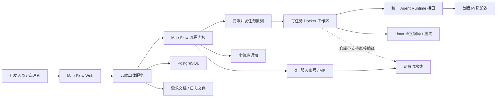

# Mae-Flow 云端 MVP 设计

## 1. 背景与目标

Mae-Flow 当前以 Claude Code/CodeAgent 插件形式运行。团队希望增加一个公司内网云端系统，让开发人员在网页中发起自己的需求，由 Agent 按 Mae-Flow 流程完成需求澄清、设计、编码、编译、质量验证和 Git 交付；管理者能够查看任务进度、等待事项、质量证据和最终 MR。

首版的核心目标不是复制一个通用 AI IDE，而是验证以下价值：

1. AI 能否在统一流程下独立把真实需求推进到可合入 MR；
2. 交付速度能否提升，同时缺陷和返工不恶化；
3. 人工审批、机器证据和交付结果能否统一记录并审计；
4. 云端迁移是否完整复用 Mae-Flow 的流程内核，而不是重新实现一套近似流程。

首版直接用户是开发人员，管理者使用任务看板查看交付事实。任务完成定义为：代码和测试已通过 Mae-Flow 质量链，领域文档已归档，正式 MR 已创建且权威流水线通过，等待人工合入。

## 2. 成功标准

内部试点选择 1 个真实仓库、2–3 位开发人员和 5 个真实需求。试点通过必须同时满足：

- 至少 4 个需求无需人工使用 CLI、改状态文件或绕开流程，即可到达流水线通过的 MR；
- 无流程死锁、重复确认、状态倒退和相同命令无进展重试；
- 编译、CodeCheck、UT、人工审批、提交和流水线结果能够从任务页面追溯；
- 记录交付总耗时、Agent 执行时间、等待人工时间、编译时间、返工轮次和最终缺陷；
- 至少验证一个 Java/Maven 场景和一个 C++ 场景；若试点仓库只有一种技术栈，则补充另一技术栈的独立可行性验证。

使用人数和任务发起量只作为辅助指标，不单独证明产品价值。

## 3. 首版范围

### 3.1 包含

- 公司内网网页应用；
- 管理员预配置的 Git 仓库列表；
- 网页输入需求或上传本地需求文档；
- Mae-Flow 完整需求路径；
- Pi Agent Runtime 适配器；
- 每任务独立 Docker 工作区；
- Linux 工作区内直接编译，失败的仓库使用现有流水线编译；
- 小鲁班人工待办通知；
- 全员可见的任务看板和任务详情；
- 统一 Git 服务账号创建需求分支和 MR；
- PostgreSQL 状态存储和服务器文件存储；
- 任务恢复、循环检测和诊断证据；
- 最终领域文档归档。

### 3.2 明确不包含

- 登录、身份认证和细粒度权限；
- 公网访问；
- Kubernetes、弹性扩缩容和多机调度；
- 本地 Runner、本地编译桥和个人执行节点；
- Full 之外的 Hotfix、Tweak、Review-fix 和月光模式；
- 跨仓 Chain；
- 用户自定义模型 API 或多个 Runtime 同时支持；
- Git 个人身份授权；
- 外部工单系统自动同步；
- 物理删除任务；
- 团队排名、绩效或提示词监控。

上述能力可以保留扩展接口，但不得进入首版交付路径。

## 4. 总体架构



系统采用一台 Linux 服务器和 Docker Compose 部署。Web、API、编排器和管理功能在同一个云端应用中实现，避免首版微服务化；PostgreSQL 独立容器保存结构化状态。任务执行通过 Docker 创建隔离工作区，最大并发由管理员配置，超出后排队。

实现技术（2026-08-14 拍板：语言按亲和选，仓库按权威分）：

- 流程内核：Python 3.11+，仓库 `mae-flow`，唯一规则权威，容器内以 CLI 形态被调用；
- 云端服务层：TypeScript/Node，仓库 `mae-flow-cloud`——Pi 是 TypeScript，
  经 SDK **进程内**嵌入（`createAgentSession`），tool_call 钩子即同步拦截，
  自定义工具的未 resolve Promise 即人工节点挂起，子 Agent 为同进程平行会话；
- 服务层与内核的接缝是**语言中立的数据契约**：transcript 同形 JSONL、
  `.mae-flow.json` 状态文件、结构化事件——TS 写现场，内核契约裁决，
  两侧不共享代码、不复刻规则；
- Web API 与事件流：Node HTTP；命令使用 REST，任务事件使用 SSE 单向推送；
- 前端：React、TypeScript、Vite；
- 数据库：PostgreSQL；
- 任务隔离：Docker Engine；
- Agent Runtime：固定版本 Pi（开源 pi-mono coding agent），版本随 mae-flow-cloud 锁定；
- 部署：Docker Compose；
- 文件存储：服务器受控目录，路径与摘要写入 PostgreSQL。

首版固定使用上述技术栈。单体控制面、共享流程内核和每任务隔离工作区是不可变更的架构边界。

## 5. 组件职责

### 5.1 Web 应用

Web 只承担交互与展示，不自行推断状态：

- 首页按等待人工、运行中、排队、失败和完成展示所有任务；
- 创建任务时只要求选择仓库、输入需求或上传 UTF-8 `.md`/`.txt` 文档、填写小鲁班通知账号；单文件上限 20 MiB；
- 任务详情以对话为主，当前审批卡直接嵌入对话；
- 流程步骤、Spec、Story、Grill、日志、Diff 和质量证据按需展开；
- 管理看板展示小鲁班通知账号、状态、耗时、等待人工时间、编译/测试结果、恢复次数和 MR；
- 所有写操作携带任务状态版本，状态过期时返回“任务状态已变化”，不覆盖先到决定。

首版没有登录。公司内网内的任何访问者都能查看和操作所有任务，系统不宣称可靠识别了实际审批人。

### 5.2 云端单体服务

单体服务包含清晰隔离的逻辑模块：

- 任务 API：创建、查询、停止、归档和事件订阅；
- 流程编排：驱动 Mae-Flow 状态机并落盘事件；
- 人工审批：创建结构化待办、校验状态版本、消费决定；
- Runtime 编排：创建工作区、启动 Pi 适配器、接收工具事件；
- 仓库管理：读取管理员维护的仓库配置；
- Git 交付：分支、提交、临时编译 Ref、推送和 MR；
- 构建与质量：直接编译、流水线适配、CodeCheck 和 UT；
- 通知：把 `WAITING_FOR_HUMAN` 事件投递给小鲁班；
- 审计与指标：记录状态迁移、机器事实、外部动作和耗时。

这些模块先在一个部署单元内实现，通过显式接口通信，避免文件级全局状态和彼此读取内部表结构。

### 5.3 Mae-Flow 共享内核

现有 Mae-Flow 状态机、证据规则、质量路由、Git 清单、领域归档和循环收敛逻辑是唯一权威实现。云端不得复制并改写一套新的流程规则。

迁移时把宿主相关能力与流程内核分开：

- 保留在内核：步骤定义、状态迁移、证据规则、人工节点、重试预算、交付清单和领域归档；
- 保留在旧插件适配层：Claude/CodeAgent Hook 载荷、CLI 展示和宿主生命周期捕获；
- 新增云端适配层：结构化 Web 审批、Pi 生命周期事件、容器工具执行和小鲁班通知。

Web 审批结果直接作为结构化决定进入状态机，不经过自然语言消息捕获，也不让 Agent 猜 CLI 参数。

#### 灵魂与机制的边界

迁移复用的是不变式（灵魂），不是旧插件在 Claude/CodeAgent 宿主里的具体实现（机制）。实施时按此判别，机制允许换、灵魂不许丢：

| 不变式（必须原样成立） | 旧插件机制（允许换实现） |
|---|---|
| 机器只拦谎言：伪证与 Git 问题当场拦下，格式与充分性交人工 | PreToolUse exit 2 同步拦截 |
| 证据必须来自真实执行：真跑过 + 退出码 + 产物指纹，未知不算通过 | 解析宿主 JSONL transcript 提证据 |
| 人工节点一个不少，决定是结构化的 | AskUserQuestion 工具调用捕获 |
| 单一裁决源：阶段真相只有一处，其余只读 | `.mae-flow.json` + 文件锁 |
| 循环收敛：相同输入相同动作相同错误禁止重复，预算硬上限 | Hook 侧指纹比对 |
| 凡请用户检视的东西，必须能在页面直接查看 | panel 单文件 HTML 快照 |
| 执行层是对 GLM-5.1 的实弹补偿，模型未换则一行不删 | flow/steps 步骤正文 |

云端适配层可以为 Pi 重新实现右列任何一项，但重新实现必须逐条对回左列验收；左列任何一条在新宿主里不成立，视为迁移失败而不是"云端特性差异"。Pi 与 CodeAgent 底层同为 GLM-5.1，因此步骤文档中的执行层补偿全部保留，不做"顺手精简"。

### 5.4 Agent Runtime 接口

Mae-Flow 内核依赖稳定的 Runtime 接口，不依赖 Pi 的私有对象。接口至少包含：

- 创建、恢复和终止会话；
- 发送用户消息与流程上下文；
- 流式接收 Agent 文本、工具调用和工具结果；
- 读写任务工作区；
- 上报会话完成、失败和取消；
- 向状态机请求结构化人工输入；
- 记录外部动作的幂等键。

首版只实现固定版本 Pi 适配器。Pi 对终端用户不可见，版本由 Mae-Flow 发布包固定，任务运行期间不得漂移。

适配层的详细设计见 [2026-08-14-cloud-host-adapter-design.md](2026-08-14-cloud-host-adapter-design.md)（语义事件模型、证据源替换、门禁执行点、人工节点通道与子 Agent 桥）。

### 5.5 任务工作区

每个任务获得独立 Docker 容器和代码卷：

- 从管理员配置的仓库克隆代码；
- 从确认的基线分支创建规则化需求分支；
- 启动 Pi Runtime 和工具执行环境；
- 挂载受控的 Maven 依赖缓存和编译缓存；
- 禁止挂载其他任务的代码卷；
- 任务完成后保留 7 天，再清理工作区；
- 停止任务只终止进程并保留现场，不删除任务记录。

任务镜像初始化时一次性安装 Git、C++ 工具链、JDK、Maven 和 Agent Runtime。任务执行期间不重复安装基础工具。缓存按仓库、工具链版本和依赖摘要键控，不共享完整可变 Build 目录。

## 6. 仓库配置

仓库由管理员预先接入。每个仓库配置至少包含：

- 展示名称和 Git URL；
- 默认基线分支；
- 需求分支命名规则；
- 直接编译镜像或基础镜像版本；
- 工作目录和编译命令；
- CodeCheck 命令与结果解释方式；
- UT 生成方式、运行命令和结果解释方式；
- 领域文档目录和模板；
- 流水线项目、触发方式、目标 Job 和结果查询方式；
- Git 服务账号可访问范围；
- 超时、并发和缓存配置。

首次接入必须在干净 Linux 容器中验证真实仓库：

1. 克隆和依赖准备；
2. 完整编译；
3. UT；
4. 修改少量代码后的第二次增量编译；
5. 两个独立任务并发运行；
6. 编译产物和缓存互不污染。

验证通过的仓库标记为 `direct`。无法在任务容器直接编译的仓库标记为 `pipeline`，不得让 Agent 每次任务临时猜测路线。

## 7. 编译与流水线策略

### 7.1 直接编译

`direct` 仓库在任务工作区内运行已确认编译命令。Java 使用固定 JDK/Maven 与内部 Maven 配置；C++ 使用仓库真实的 Linux 编译脚本或 CMake/Ninja/Make 命令。

代码编译错误必须在当前路线内修复。只有容器、网络、依赖服务或基础工具故障才属于基础设施错误；仓库配置了开发期流水线时允许进入流水线兜底，否则进入人工待办。不能以切换路线掩盖代码错误。

### 7.2 流水线编译

`pipeline` 仓库在开发期也必须及时编译，不能等最终 MR。系统用服务账号把当前工作树快照推送到命名空间隔离的临时 Ref：

```text
refs/mae-flow/build/<task-id>/<attempt>
```

若 Git 服务不支持自定义 Ref，则使用系统临时分支。流水线只运行编译所需 Job，结果与代码摘要绑定。临时 Ref 不进入最终 MR 历史，任务结束后清理。

### 7.3 最终流水线

无论开发期使用直接编译还是流水线编译，正式 MR 都必须运行现有权威流水线。最终流水线失败时，任务重新进入受控修复链；源码发生变化必须重新编译、展示新增 Diff 并获得人工确认。达到循环预算后进入人工裁决，不无限修复。

## 8. 完整需求流程

首版仅支持 Mae-Flow Full 路径，顺序如下：

1. 创建任务：仓库、需求文字/文档、小鲁班账号；
2. 创建工作区并探测任务配置；
3. 配置确认：单号、需求、基线分支、规则化分支、编译、CodeCheck 和 UT；
4. 选择是否启用 Agent CODE Reviewer；
5. 创建或确认需求分支；
6. Interactive Grill；
7. 用户确认本地 Spec；
8. 生成 Story 和实施附录，执行 Agent 设计检视，用户确认；
9. 主 Agent 整体编码，不使用 CP，不派实现子 Agent；
10. 专项编译验证；
11. 可选 Agent 代码预检；
12. 用户检视完整未提交 Diff；
13. 用户通过后形成受控本地交付提交；
14. 代码精简、CodeCheck 和 UT；
15. 质量阶段修改源码或测试时重新编译，并统一展示新增 Diff；
16. Spec 与最终实现核对；
17. 用户确认领域事实候选并归档领域文档；
18. 用户确认精确交付清单和提交说明；
19. 整理最终提交、推送需求分支并创建 MR；
20. 等待权威流水线，通过后标记为“等待合入”。

固定人工节点和条件性裁决全部保留。包括配置、Grill、Spec、Story、未提交代码 Diff、质量 Diff、领域归档、交付清单，以及分支冲突、CodeCheck 范围/豁免、UT 源码缺陷、Spec 偏差、推送分叉和风险放行。

## 9. 人工审批与小鲁班通知

所有人工节点统一创建结构化 `WAITING_FOR_HUMAN` 记录，至少包含：

- 任务 ID、单号和仓库；
- 当前步骤和等待原因；
- 待审对象摘要、文件或 Diff 链接；
- 可选决定和推荐决定；
- 状态版本；
- 创建时间、提醒次数和完成时间。

进入等待状态后：

1. 任务暂停；
2. 首页、任务页顶部和对话中同时显示同一待办；
3. 小鲁班向任务创建时填写的账号发送消息和审核链接；
4. 任意内网用户可以在网页完成审批；
5. 第一个匹配状态版本的决定生效，后续提交返回状态已变化；
6. 小鲁班消息回复不参与决定捕获；
7. 通知失败不自动批准，任务仍保持等待并在页面标红。

首版没有身份认证，因此审批日志只能可靠记录时间、页面输入和状态版本，不能把浏览器提供的显示名称当作可信身份。

## 10. Git 交付

平台使用管理员配置的项目级服务账号完成克隆、临时 Ref、推送和 MR 创建。任务创建时填写的小鲁班账号和审批事实记录在任务审计中，Git 平台中的实际执行身份为 Mae-Flow Bot。

Git 操作要求：

- 基线分支和派生分支在配置卡中确认；
- 每个任务独立分支；
- 不自动 rebase、reset 或 force-push；
- 外部写操作携带幂等键，恢复时先查询真实远端状态；
- 最终清单只能包含本任务工作区的确认增量；
- 过程 Spec、Story、Grill 和原始日志不进入仓库；
- 仓库最终只提交生产代码、测试、必要配置和最终领域归档文档；
- MR 创建成功但流水线未通过时，任务状态为“验证中”，不能标记完成；
- MR 和流水线通过后状态为“等待合入”，系统不自动合并或部署。

## 11. 状态、恢复与循环收敛

**裁决源决定**：任务的阶段真相仍然只在工作区内的 `.mae-flow.json`（延续单一裁决源红线——双状态机的学费不交第二次）。PostgreSQL 保存的是它的投影和追加式事件日志，用于看板展示、审计和恢复引导；两者不一致时以工作区状态文件为准，恢复流程负责重放投影，云端服务不得直接改写阶段状态。关键外部动作在 PostgreSQL 保存请求摘要、幂等键、开始时间、完成时间、结果摘要和绑定的代码版本。

服务或任务容器重启时：

- 已完成的人工审批不重复；
- 已有同代码摘要的成功编译、CodeCheck 或 UT 证据可以复用；
- 提交、推送、MR 和流水线先查询远端真实状态，再决定是否继续；
- 无法判断外部动作是否完成时进入人工裁决；
- 任务容器丢失但工作区卷仍在时重建容器并恢复；
- 工作区也丢失时从已确认 Git 锚点恢复，未提交且无快照的改动明确标记丢失，不虚构恢复成功。

循环检测同时比较：

- 当前步骤；
- 输入代码摘要；
- 执行动作与参数；
- 错误指纹；
- 本轮代码增量；
- 新增机器证据。

相同输入、相同动作和相同错误禁止重复执行。即使每轮略有变化，也设置硬上限：编译与 UT 最多 3 个修复轮次，CodeCheck 最多 2 个修复轮次。没有新进展或达到预算时创建人工待办，展示已尝试动作、最后错误、现场链接和可选恢复动作。

## 12. 数据保留与安全边界

首版仅部署在公司内网，无登录、无租户隔离。安全边界如下：

- 所有任务对所有内网访问者可见；
- 不向公网开放服务；
- Git、模型和 Maven 凭据由后端集中加密保存；
- 任务启动时以短期文件或环境挂载注入，任务日志统一脱敏；
- Agent 不获得长期凭据存储位置；
- 任务工作区彼此隔离，不挂载宿主敏感目录；
- 任务不提供物理删除，只能停止或归档；
- 工作区默认保留 7 天；
- 原始执行日志默认保留 30 天；
- 任务摘要、Grill 决策、Spec、Story、人工决定、机器证据和 Git/MR 结果长期保留；
- 保留时长可由管理员配置。

无身份认证是内网 MVP 的明确风险接受项。进入公网、需要可信审批人或个人 Git 身份之前，必须引入公司统一身份认证和权限模型。

## 13. 管理看板与指标

任务看板展示：

- 任务单号、仓库和需求摘要；
- 小鲁班通知账号；
- 排队、运行、等待人工、失败、验证中、等待合入和已归档状态；
- 当前步骤和阻塞原因；
- 编译、CodeCheck、UT 和最终流水线结果；
- MR 链接；
- 总耗时、Agent 执行时间、等待人工时间和编译时间；
- 自动修复和人工恢复次数。

首版不展示员工排名、绩效推断、提示词字数或逐人生产率结论。

## 14. 错误处理

### 14.1 任务启动失败

仓库克隆、容器创建或配置校验失败时，任务保持可恢复的失败状态，展示失败阶段和重试条件。修复配置后从失败点继续，不重新创建重复任务。

### 14.2 Agent Runtime 失败

Pi 进程异常退出时保存最后事件和代码摘要。同一代码版本允许自动重启一次；再次失败或恢复信息不足时通知用户。任务运行期间不升级 Runtime。

### 14.3 编译与质量失败

代码问题进入受限修复循环；基础设施问题进入重试或流水线兜底。机器事实不能由用户口头“确认通过”替代，风险放行必须绑定当前步骤、代码摘要和明确原因。

### 14.4 通知失败

通知投递失败不改变流程状态。Web 待办仍然存在，后台按有限退避重试并记录投递结果，不重复生成审批记录。

### 14.5 Git 和流水线失败

网络失败有限重试；非快进、权限、保护分支和远端领先进入人工裁决。禁止自动 force-push。流水线结果与 Commit SHA 绑定，旧结果不能用于新代码。

## 15. 测试策略

### 15.1 单元测试

- 云端宿主事件到 Mae-Flow 语义事件的映射；
- 状态版本和重复审批拒绝；
- 循环指纹和重试预算；
- 直接编译与流水线路由；
- Git 清单和临时 Ref 命名；
- 小鲁班待办去重；
- 数据脱敏和保留策略。

### 15.2 契约测试

- Pi 适配器生命周期；
- Docker 工作区创建、恢复和终止；
- Git 服务账号克隆、推送和 MR；
- 流水线触发与结果查询；
- 小鲁班请求和失败响应；
- Mae-Flow 旧插件适配器与云端适配器对同一语义事件产生一致状态迁移。

### 15.3 集成测试

使用本地假 Git 服务、假模型/Runtime、假小鲁班和假流水线完整跑通：

- 正常 Full 需求；
- Grill 多轮决定；
- 两个浏览器同时审批；
- 编译错误修复；
- 直接编译基础设施故障切流水线；
- CodeCheck/UT 修改源码后的重新编译和新增 Diff 审批；
- 服务重启恢复；
- Pi 进程退出；
- 推送非快进；
- 最终流水线失败后的受控回流；
- 相同动作无进展时停止。

### 15.4 真实环境验证

在试点前完成 Java 与 C++ 的干净容器验证，并执行 5 个真实需求。所有发现的问题必须能通过事件日志和脱敏诊断信息定位，不依赖读取开发者本地终端历史。

## 16. 分阶段实施

本设计包含多个可独立验收的子项目，不能用一个大提交一次完成：

1. **阶段 0：可行性与内核边界**：验证 Java/C++ Linux 编译，定义云端宿主语义事件，抽取可复用 Mae-Flow 内核边界，完成 Pi 最小会话原型。Pi 原型必须逐项回答以下能力五问，其中第 1、4 问为一票否决——答"否"则先向 Pi 提需求，不进入后续阶段：
   1. **同步工具拦截**（一票否决）：Agent 的工具调用能否在执行前被外部程序当场拦下并打回？没有它，"机器只拦谎言"退化为事后校验，弱模型在无人盯守的容器里独走 20 步，兜不住；
   2. **结构化人工输入**：能否向状态机请求结构化决定并暂停等待（替代 AskUserQuestion 捕获）？
   3. **子 Agent 派发与生命周期事件**：能否派发质量 Agent（compile-agent、codecheck-fix、ut-generator 等）并观察其启动/结束？
   4. **工具调用流证据**（一票否决）：能否提供每次工具调用与结果的完整可解析记录（transcript 等价物），供证据判定消费？
   5. **会话恢复**：进程异常退出后能否按最后事件与代码摘要恢复会话？

   阶段 0 另含一项实弹验收：在 Pi 中完整跑一单 fieldtest 标准需求（如 REQ2026080901 同款），与 CLI 版归档逐节点对拍。测的不是流程逻辑，而是同一个 GLM-5.1 在新 harness（不同系统提示、工具格式、上下文管理）里是否长出新的绕门禁姿势；发现的差异逐条决定是补门禁还是改适配。
2. **阶段 1：单任务纵向闭环**：单仓库、单任务从创建、Grill、Spec、Story、编码、直接编译到未提交 Diff 审批。
3. **阶段 2：质量与 Git 交付**：CodeCheck、UT、领域归档、精确清单、推送、MR 和最终流水线。
4. **阶段 3：多人云端体验**：任务看板、并发队列、小鲁班通知、恢复、数据保留和管理指标。
5. **阶段 4：内部试点与加固**：5 个真实需求、故障注入、诊断闭环和试点验收。

每个阶段必须产生可运行、可测试的增量。阶段 0 未证明真实仓库能在 Linux 容器直接编译时，不进入大规模 Web 产品开发。

## 17. 关键设计结论

- 云端系统的价值是稳定交付，不是重新做一个通用 AI IDE；
- Mae-Flow 现有流程内核是唯一规则源，云端只增加宿主适配；
- 迁移保灵魂不搬机制：不变式必须逐条在新宿主验收，旧插件的实现手段允许替换；
- 阶段真相只在工作区 `.mae-flow.json`，PostgreSQL 是投影，不是第二个状态机；
- 首版采用单机 Docker Compose，不建设执行平台；
- 每个需求独立 Docker 工作区，直接使用初始化好的 Linux 工具链；
- 直接编译是主路径，流水线是仓库级兜底和最终权威门禁；
- 人工审核完整保留，并由统一等待事件驱动小鲁班通知；
- 首版无登录、全部可见，这是仅适用于内网试点的明确限制；
- 过程文档留在云端，最终领域文档进入仓库；
- 恢复、幂等和循环收敛是首版功能，不是后续优化项。
